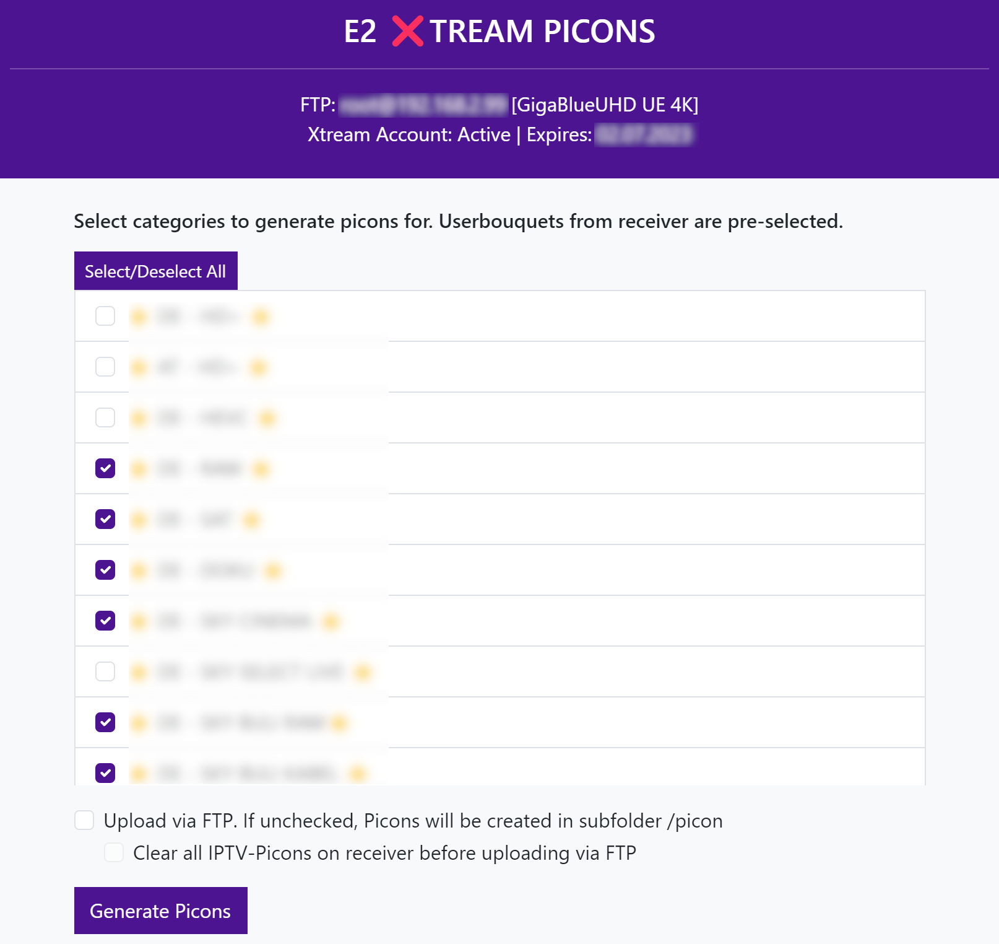

# e2xtreampicons
PHP Script to download enigma2 picons for xtream codes playlists and upload the picons to e2 receiver via ftp. This is helpful if you have created iptv bouquets with plugins like jedimakerxtream.

The picons are getting cropped and sized correctly to xpicon-size.

# Requirements
- FTP server enabled on e2 receiver
- OpenWebif enabled on e2 receiver (API reachable without authentication!)

# Usage
You have to run this script in your local network, e.g. on an apache2 webserver.

I recommend using an xampp-system on Windows, cause the php-gdlib image library has a transparency bug in some linux distributions that will lead to wired images.

If you do use xampp, just copy the php files to the htdocs folder and edit the config.php. You have to enter:

`$ftp_server = ""; //IP of e2 Receiver`

`$ftp_user = ""; // FTP User on e2 receiver`

`$ftp_pass = ""; // FTP password`

`$user = ""; // xtream codes username`

`$pass = ""; // xtream codes password`

`$dns = "http://providerdns:providerport"; // xtream codes provider url`

After that you should be able to open the webinterface in your browser via *localhost*.

The header tells you if your FTP and XTREAM connection was successfull.

If all went well, you should see your live categories in the list. Your Userbouquets from receiver are pre-selected.

Check the box, if you want to upload the picons directly to your e2 box. Otherwise, picons will be created in subfolder /picon (you have to create that first) of your htdocs folder.

Submit the page by hitting *Generate Picons*. Page should reload with an output-container at the end. Depending on amount of channels, the creation will take some time. Wait till you get the *Finished* message at the end.

Reading the output you can find errors like dead urls for picons in your providers playlist.

## Important ##
This script is just put together to just work. It is uncommented and not optimized. **It is very likely, that you have to change things to get it to work with your provider! I did only test it with my provider.**

